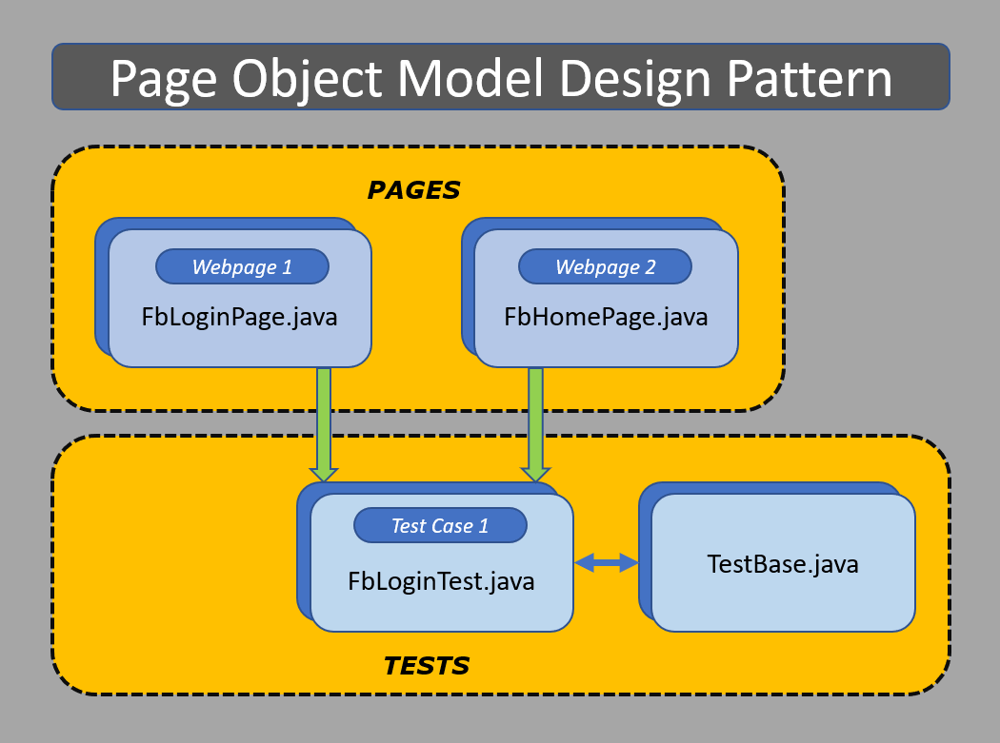
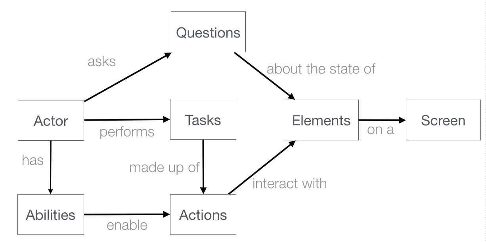

# AutomationFramework

## Framework para automatizacion UI/API

Vamos a utilizar este framework en el modulo

https://serenity-bdd.github.io/theserenitybook/latest/screenshot.html

## API client

Serenity lo maneja por debajo para la conexion con API

https://rest-assured.io/

## Manejo de UI, locators, waits, etc.

Serenity lo maneja por debajo

https://www.selenium.dev/

## Administrador de web drivers(Soporte a chrome, firefox, edge y otros)

Vamos a utilizar en el modulo

https://github.com/bonigarcia/webdrivermanager

## Framework para BDD

Vamos a utilizar en el modulo

https://cucumber.io/

## Otros

### Framework para automatizar app web en angular

https://www.protractortest.org/#/

### Framework para automatizar app UI

https://www.cypress.io/

## Patrones

### Page Object Model

### Screen Play

